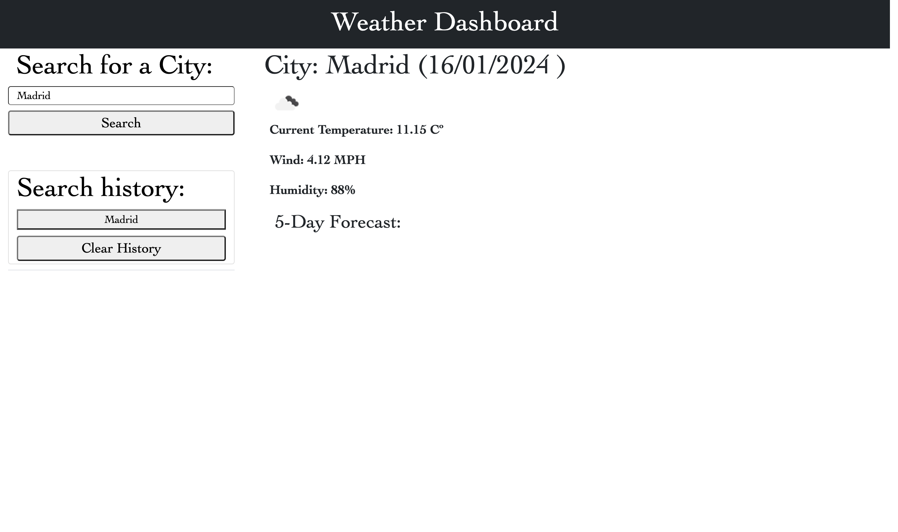

# WEATHER DASHBOARD

## Description

Build a weather dashboard that will run in the browser and feature dynamically updated HTML and CSS.

Use the 5 Day Weather Forecast to retrieve weather data for cities.

## Installation
Website:
https://joeviser.github.io/WeatherDashboard/

Screenshot Image:

## Usage

Create a weather dashboard that contains the following requirements:

  - When a user searches for a city they are presented with current and future conditions for that city and that city is added to the search history
  - When a user views the current weather conditions for that city they are presented with:
    - The city name
    - The date
    - An icon representation of weather conditions
    - The temperature
    - The humidity
    - The wind speed
  - When a user view future weather conditions for that city they are presented with a 5-day forecast that displays:
    - The date
    - An icon representation of weather conditions
    - The temperature
    - The humidity

## Credits

"N/A"

## License

Please refer to the LICENCE in the repo.